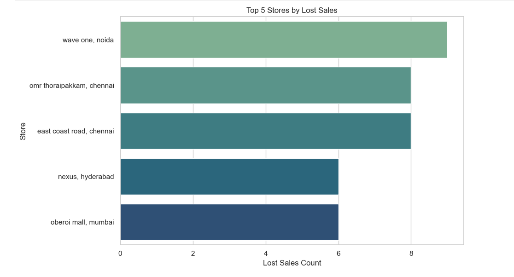
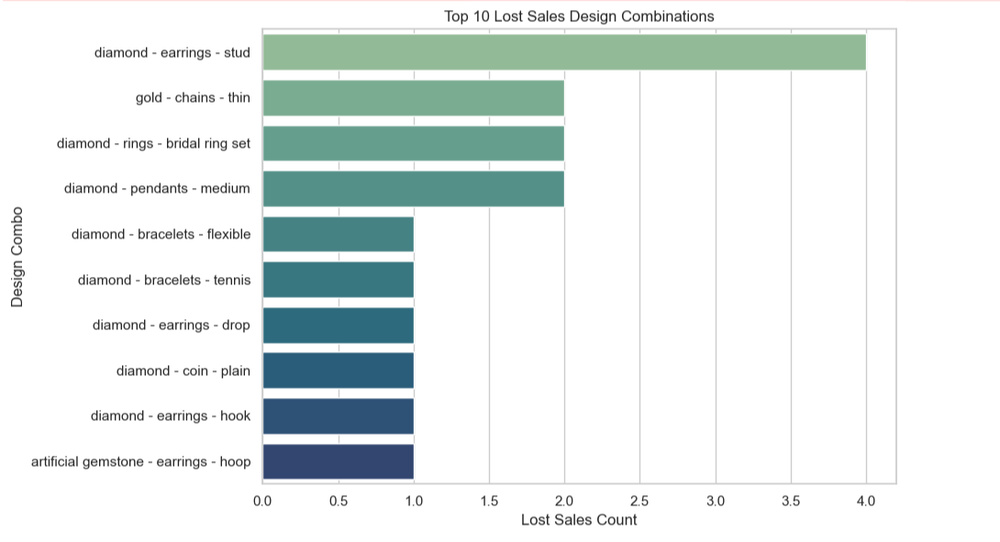

# Bluestone Lost Sales Analysis

---

## Why I Built This

I have been a Bluestone customer since I was 16. There was this one necklace I absolutely loved and had been eyeing for two years. My dad promised he would take me to buy it on my 18th birthday. We went to the store, and it was not available.

Fast forward to my third year of college, I came across Bluestone's lost sales dataset — records of customers who walked into a store, liked something, and left without buying because it was not there. Before heading back to Bluestone for another purchase, it hit me: I had been one of these data points. So I decided to actually look at the numbers.

---

## What This Project Is About

Bluestone has a strong offline retail presence across India. Every time a customer walks in, shows interest, and leaves empty handed, that is a lost sale. This project digs into 300 such records to figure out which stores are losing the most customers, which designs are being asked for repeatedly but never stocked, and where the real inventory gaps are.

---

## Dataset

300 in store customer interaction records from Bluestone retail outlets across India. Each record captures the store, the type of customer, the jewellery category and design they were looking for, and their price range. The data was queried using SQL to filter, group, and rank patterns before any deeper analysis.

---

## Key Business Insights

**The same five stores keep losing customers**

Wave One in Noida, OMR Thoraipakkam and East Coast Road in Chennai, Nexus in Hyderabad, and Oberoi Mall in Mumbai had the highest number of customers walking out without buying. That is not a coincidence. These are high footfall stores where inventory is clearly not keeping up with what people actually want.

**The most requested designs are the most basic ones**

Gold earring studs came up 10 times. Gold thin chains 8 times. Diamond ring bands 7 times. These are not unusual or exotic requests. They are everyday jewellery staples, which makes it worse that they kept going unfulfilled.

**Smaller stores are not stocked with what bigger stores are losing sales on**

Stores like Centrio Mall in Dehradun, Viviana Mall in Thane, and Pacific Mall in New Delhi had very few lost sales recorded. But the designs missing from those stores are exactly what customers in top stores were asking for and not finding. This is not a demand problem. It is an inventory distribution problem.

**Most customers are shopping in the 20k to 1L range**

A large chunk of interested customers were looking at mid range gold and diamond pieces. Stores that do not carry enough variety in this bracket are likely the ones losing the most conversions.

---

## Visuals

### Stores with the Highest Lost Sales

### Most In Demand Design Combinations Going Unfulfilled

---

## Tools Used

SQL to query and rank the data, Python with pandas for cleaning, and Excel as the raw data source.

---

## What Bluestone Should Do Differently

Restock diamond earring studs, thin gold chains, and ring bands at high traffic stores. Run an assortment audit at mid tier outlets and align their inventory to what the busier stores are already seeing demand for. A lot of these lost sales are not hard to fix. The demand is clearly there.
